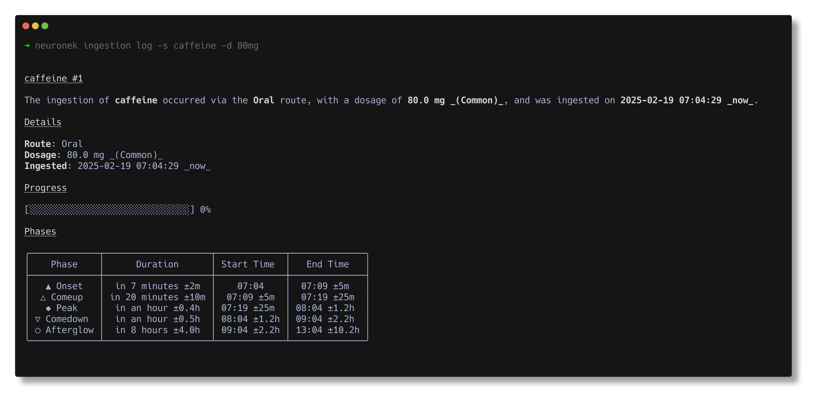

# Neuronek

🧬 Intelligent dosage tracker application for monitoring supplements, nootropics and psychoactive substances along with
their long-term influence on one's mind and body.



## About

Neuronek is an intelligent dosage tracking application designed to monitor and log the use of supplements, nootropics,
and
psychoactive substances. By recording and analyzing ingestion, it helps users better understand the long-term effects
of these compounds on their physical and mental health.

Features offered by application include:

- **Ingestion journaling** with a set of commands which allows for inserting, updating, retrieving and deleting all the
  data stored as `Ingestion` model.

## Installation

To install the application, please visit the [GitHub Releases Page](https://github.com/keinsell/neuronek/releases) for
pre-built binaries and installation instructions for your platform. Alternatively, you can install the application from
supported package managers or build it from source.

#### Using a package manager (recommended)

> [!WARNING]
> Application is in early stage of development and to avoid polluting package managers with application that can be
> potentially dead in few months I do recommend installing from source or using available pre-build binaries.
> Application will be available for `homebrew`, `pacman`, `nix`, `scoop`, `dnf` and `apt` when it would be considered
> production-ready.

#### Installation from source (Advanced)

Application can be installed with `cargo` and providing url to this repository,
this may be the most conformable way for users which are looking for the latest version of application, proceed only if
you have development experience as application might require manual fixes from your side by this release channel.

```
cargo install --git https://github.com/keinsell/neuronek
```

**Note:** This method might be best for users who always want the absolute newest version of the application. However,
it may be less stable than the pre-built binaries.

```bash
❯ neuronek --help
```

## Usage

### Ingestion Journaling

Ingestions are the cornerstone of the Neuronek tracking system, representing each instance when a user consumes a chemical compound. Each ingestion record captures critical pharmacological data: the specific substance consumed, the route of administration, precise dosage, and timestamp of consumption. The application provides a comprehensive yet intuitive command-line interface that enables users to create, retrieve, update, and delete these records with minimal friction. This structured approach to substance tracking allows for detailed analysis of consumption patterns, pharmacokinetics, and subjective effects over time, facilitating improved understanding of how various compounds affect individual physiology and psychology.

#### Log Ingestion

*Logs the ingestion of a specified substance with the given dosage.*

```bash
neuronek ingestion log -s caffeine -d 80mg
```

```present cargo run -- -f pretty ingestion log -s caffeine -d 80mg
╭──────────────────────────────┬───────────────────────────────────────────╮
│  ID:         5               ┆  — Onset      18:35       →  18:40±5m     │
│  Substance:  Caffeine        ┆  ↑ Comeup     18:40±5m    →  18:50±25m    │
│  Dosage:     80.0 mg         ┆  ≡ Peak       18:50±25m   →  19:35±1.2h   │
│  Route:      Oral            ┆  ↓ Comedown   19:35±1.2h  →  20:35±2.2h   │
│  Ingested:   18:35 02/04/25  ┆  ≈ Afterglow  20:35±2.2h  →  00:35±10.2h  │
╰──────────────────────────────┴───────────────────────────────────────────╯
```

#### View Ingestion

*Displays detailed information about a specific ingestion identified by its ID.*

> ![WARNING]
> Ingestion viewing user interface is a subject to change to one that would be compact yet will contain most important
> information, please share your feedback and expectations in revelant github issues.

```bash
neuronek ingestion view <INGESTION_ID>
```

```present cargo run -- -f pretty ingestion view 1
╭──────────────────────────────┬───────────────────────────────────────────╮
│  ID:         1               ┆  — Onset      13:56       →  14:01±5m     │
│  Substance:  Caffeine        ┆  ↑ Comeup     14:01±5m    →  14:11±25m    │
│  Dosage:     90.0 mg         ┆  ≡ Peak       14:11±25m   →  14:56±1.2h   │
│  Route:      Oral            ┆  ↓ Comedown   14:56±1.2h  →  15:56±2.2h   │
│  Ingested:   13:56 02/04/25  ┆  ≈ Afterglow  15:56±2.2h  →  19:56±10.2h  │
╰──────────────────────────────┴───────────────────────────────────────────╯
```

#### List Ingestions

*Lists all recorded ingestions along with their details such as ID, substance, route of administration, dosage, and
ingestion date.*

```bash
neuronek ingestion list
```

```present cargo run -- -f pretty ingestion ls
╭────┬───────────┬─────────┬───────┬──────────────────────────────────────╮
│ ID │ Substance │ Dosage  │ Route │             Ingested At              │
├────┼───────────┼─────────┼───────┼──────────────────────────────────────┤
│ 5  │ Caffeine  │ 80.0 mg │ Oral  │ 2025-04-02 18:35:30.639316161 +02:00 │
├────┼───────────┼─────────┼───────┼──────────────────────────────────────┤
│ 4  │ Caffeine  │ 80.0 mg │ Oral  │ 2025-04-02 13:58:03.226040214 +02:00 │
├────┼───────────┼─────────┼───────┼──────────────────────────────────────┤
│ 3  │ Caffeine  │ 80.0 mg │ Oral  │ 2025-04-02 13:57:42.340561472 +02:00 │
├────┼───────────┼─────────┼───────┼──────────────────────────────────────┤
│ 2  │ Caffeine  │ 80.0 mg │ Oral  │ 2025-04-02 13:57:18.600975188 +02:00 │
├────┼───────────┼─────────┼───────┼──────────────────────────────────────┤
│ 1  │ Caffeine  │ 90.0 mg │ Oral  │ 2025-04-02 13:56:50.436598779 +02:00 │
╰────┴───────────┴─────────┴───────┴──────────────────────────────────────╯
```

#### Update Ingestion

*Updates the dosage of a specific ingestion identified by its ID.*

```bash
neuronek ingestion update 1 -d 90mg
```

```present cargo run -- -f pretty ingestion update 1 -d 90mg
╭──────────────────────────────┬────────────────────────────────────────╮
│  ID:         1               ┆ No phases recorded for this ingestion. │
│  Substance:  Caffeine        ┆                                        │
│  Dosage:     90.0 mg         ┆                                        │
│  Route:      Oral            ┆                                        │
│  Ingested:   13:56 02/04/25  ┆                                        │
╰──────────────────────────────┴────────────────────────────────────────╯
```

#### Delete Ingestion

*Deletes a specific ingestion identified by its ID from the records.*

```bash
neuronek ingestion delete 14
```

```
Ingestion #14 has been successfully deleted.
```

### Substances

Application comes with a pre-bundled database of psychoactive substances built on top
of [PsychonautWiki](https://psychonautwiki.org), such information is easily queryable through CLI and is foundation
for further analysis of user's ingestion to provide insight on harm-reduction and predicting subjective effects.

#### Get Substance

```bash
neuronek substance get caffeine
```

```present cargo run -- -f pretty substance get caffeine
╭─────────────┬──────────────────────────────────┬────────────────────────╮
│ Caffeine                                                                │
├─────────────┼──────────────────────────────────┼────────────────────────┤
│ Route       │ Dosage                           │ Phases                 │
├─────────────┼──────────────────────────────────┼────────────────────────┤
│ Insufflated │  (±) Threshold  ≤2.50 mg         │  — Onset      30s-2m   │
│             │  (+) Light      10.0 mg-25.0 mg  │  ↑ Comeup     30s-2m   │
│             │  (++) Common    25.0 mg-40.0 mg  │  ≡ Peak       30m-1h   │
│             │  (+++) Strong   40.0 mg-80.0 mg  │  ↓ Comedown   6h-10h   │
│             │  (++++) Heavy   ≥80.0 mg         │  ≈ Afterglow  6h-1d    │
├─────────────┼──────────────────────────────────┼────────────────────────┤
│ Oral        │  (±) Threshold  ≤10.0 mg         │  — Onset      5m-10m   │
│             │  (+) Light      20.0 mg-50.0 mg  │  ↑ Comeup     10m-30m  │
│             │  (++) Common    50.0 mg-150 mg   │  ≡ Peak       45m-1h   │
│             │  (+++) Strong   150 mg-500 mg    │  ↓ Comedown   1h-2h    │
│             │  (++++) Heavy   ≥500 mg          │  ≈ Afterglow  4h-12h   │
╰─────────────┴──────────────────────────────────┴────────────────────────╯
```

### Formulation

**Formulation** is a combination of ingredients that are used to create a specific effect. The formulation of a drug can
vary depending on the desired effect and the route of administration. Such compositions can be manually created for
representation of reccuring ingestion templates.

#### Create Formulation

This command allows you to create a new formulation. You can specify the name, description, and ingredients. Ingredients
are added by associating them with specific quantities. This ensures consistent and accurate preparation of the
formulation.

```bash
neuronek formulation create --name <FORMULATION_NAME>  
```

```present cargo run -- --format pretty formulation create --name "Quilla Mind"
╭────┬─────────────┬─────────────┬─────────────╮
│ id │ name        │ description │ ingredients │
├────┼─────────────┼─────────────┼─────────────┤
│ 2  │ quilla mind │ ---         │ {}          │
╰────┴─────────────┴─────────────┴─────────────╯
```

#### Get Formulation

Retrieves details about a specific formulation, including its name, description, and list of ingredients with their
respective quantities.

```bash
neuronek formulation get <FORMULATION_ID>
```

```present cargo run -- --format pretty formulation get 1
╭────┬─────────────┬─────────────┬─────────────╮
│ id │ name        │ description │ ingredients │
├────┼─────────────┼─────────────┼─────────────┤
│ 1  │ quilla mind │ ---         │ {}          │
╰────┴─────────────┴─────────────┴─────────────╯
```

#### List Formulations

Lists all available formulations along with their IDs, names, and descriptions.

```bash
neuronek formulation list
```

```present cargo run -- --format pretty formulation list
╭────┬─────────────┬─────────────┬─────────────╮
│ id │ name        │ description │ ingredients │
├────┼─────────────┼─────────────┼─────────────┤
│ 1  │ quilla mind │ ---         │ {}          │
├────┼─────────────┼─────────────┼─────────────┤
│ 2  │ quilla mind │ ---         │ {}          │
├────┼─────────────┼─────────────┼─────────────┤
│ 3  │ quilla mind │ ---         │ {}          │
├────┼─────────────┼─────────────┼─────────────┤
│ 4  │ quilla mind │ ---         │ {}          │
├────┼─────────────┼─────────────┼─────────────┤
│ 5  │ quilla mind │ ---         │ {}          │
╰────┴─────────────┴─────────────┴─────────────╯
```

#### Update Formulation

Modifies an existing formulation. You can update its name, description, or ingredients.

#### Delete Formulation

Removes a formulation from the system. Operation itself is destructive and require additional confirmation from user in interactive shell or `-y`/`--no-confirm` in non-interactive mode to omit protection against destructive operation.

```
neuronek formulation delete <FORMULATION_ID>
```

```present cargo run -- --format pretty formulation delete 1 --no-confirm
Formulation deleted successfully
```

##### Formulation Ingredients

This section describes commands related to managing ingredients within a specific formulation.

###### Get Formulation Ingredient

Retrieves details about a specific ingredient within a given formulation, including its quantity.

```bash
neuronek formulation ingredient rm <INGREDIENT_ID>
```

###### List Formulation Ingredients

Lists all ingredients and their quantities associated with a specific formulation.

```bash
neuronek formulation ingredient ls
```

###### Add Formulation Ingredient

Adds a new ingredient to a formulation with a specified quantity.

```bash
neuronek formulation ingredient rm <INGREDIENT_ID>
```

###### Update Formulation Ingredient

Modifies the quantity of an existing ingredient within a formulation.

```bash
neuronek formulation ingredient rm <INGREDIENT_ID>
```

###### Remove Formulation Ingredient

Removes an ingredient from a formulation.

```bash
neuronek formulation ingredient rm <INGREDIENT_ID>
```

## Contributing

The Project does not expect any external contribution. If you want to contribute, please contact me directly
via [keinsell@protonmail.com,]() and we can discuss the project together and move code to
organization out of my profile.

See [CONTRIBUTING.md](CONTRIBUTING.md) for more information.

## License

Read the [LICENSE](LICENSE) file for more information.
